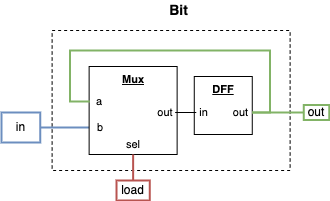
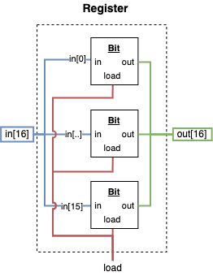
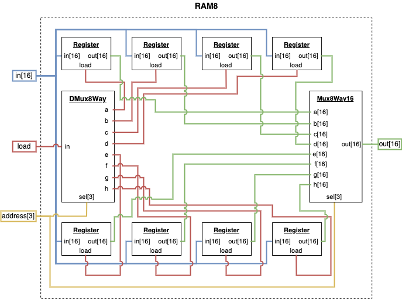
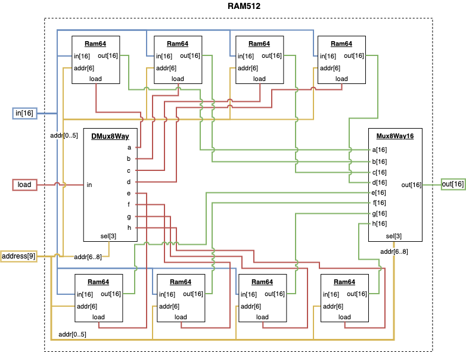
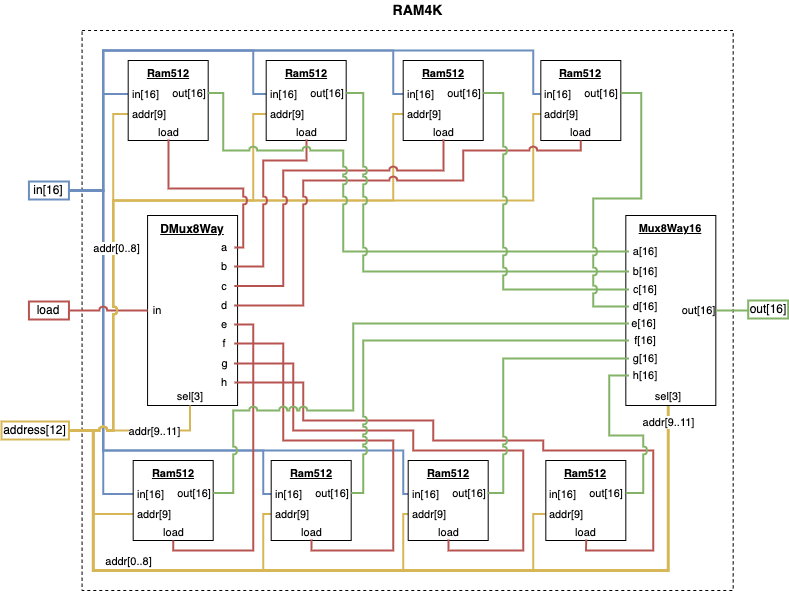
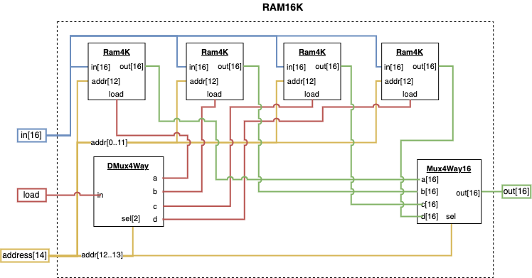
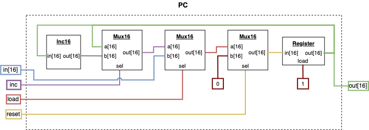

[Back](../README.md)

# Course 1 Project 3

Building the chips that allows the computer to remember stuff. Registers and RAM.

## DFF - Data Flip-Flop - **_Provided by the Course_**

The `DFF` chip is provided by the course and takes a single input and a single output and simply remembers are value across time units.

## Bit

The bit is a wrapper for the Data Flip-Flop chip and includes a `load` control bit that will only "load" the input into the DFF if it is enabled, otherwise the DFF will simply keep its existing value.

### Diagram

Uses a Mux (Multiplexer) gate to decide whether the input should be loaded into the DFF chip.



## Register

A Register is simply a 16-bit version of the `Bit` chip and contains 16 individual bits controlled by a single `load` control bit.

### Diagram

This diagram only shows 3 of the 16 `Bit` chips for simplicity.



## RAM8

Contains 8 Registers and utilizes a 3-bit address input to select which Register's value should be manipulated by the 16-bit input and load bits, and which Register should be sent to the single 16-bit output.

### Diagram

Uses the 8 Way DMux and Mux chips constructed in project 1 to route the load bit and the Register outputs.



## RAM64

The same idea as the `RAM8` chip except that it uses `RAM8` chips and a 6-bit address bit to cover all possible register addresses.

### Diagram

Uses the last 3 digits of the address bit for DMux and Mux operations, and simply sends the first 3 digits to the `RAM8` chips.


## RAM512

The same idea as the `RAM64` chip except that it uses `RAM64` chips and a 9-bit address bit to cover all possible register addresses.

### Diagram

Uses the last 3 digits of the address bit for DMux and Mux operations, and simply sends the first 6 digits to the `RAM64` chips.



## RAM4K

The same idea as the `RAM512` chip except that it uses `RAM512` chips and a 12-bit address bit to cover all possible register addresses.

### Diagram

Uses the last 3 digits of the address bit for DMux and Mux operations, and simply sends the first 9 digits to the `RAM512` chips.



## RAM16K

A similar idea as the `RAM4K` chip except that it only uses 4 `RAM4K` chips and a 14-bit address bit to cover all possible register addresses.

### Diagram

Uses the last 2 digits of the address bit for 4 Way DMux and Mux operations, and simply sends the first 12 digits to the `RAM4K` chips.



## PC - Program Counter

An abstraction around a single `Register` chip that allows us to perform the operations necessary for iterating and jumping through the instructions of a program. The normal register I/O and load bits are present, but additional `reset` and `inc` control pins are added for additional functionality.

### Functionality

```
if reset == 1:
  out = 0
else if load == 1:
  out = in
else if inc == 1:
  out = current + 1
else:
  out = current
```

### Diagram

This diagram orders the chain of multiplexed outputs in backwards order with the output of the `reset` multiplexer sitting closest to the actual register. this means that if the `reset` is disabled it will use the `load` output. If `load` is disabled it will use the `inc` output, and if `inc` is disabled it will keep the existing register value.

